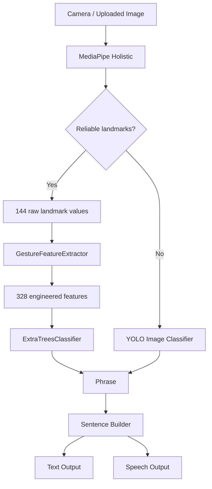

# 🤟 Sign Language to Speech Converter

> **Real-time sign-language phrase recognition with landmark-based ML, intelligent fallback inference, sentence construction, and speech output.**

[](https://www.python.org/)
[](https://scikit-learn.org/)
[](https://ai.google.dev/edge/mediapipe/solutions/vision/holistic_landmarker)
[](https://github.com/ultralytics/ultralytics)
[](#-system-architecture)
[](#-artifact-integrity--validation)

---

## ✨ What makes this project different?

This is not only an image classifier. It is a **production-oriented computer-vision and machine-learning pipeline** designed to turn visual sign observations into usable phrases and optional speech.

The primary path uses **MediaPipe Holistic landmarks → geometric feature engineering → ExtraTrees classification**, while a **YOLO image-classification path** is retained as a secondary fallback when reliable landmarks cannot be obtained.

### At a glance

| Capability | Implementation |
|---|---|
| 🎥 Real-time recognition | Webcam inference |
| 🧠 Primary ML model | scikit-learn Pipeline + ExtraTreesClassifier |
| 📐 Feature engineering | 144 raw landmarks → 328 engineered features |
| 🤟 Production classes | **43 phrase classes** |
| 🧭 Landmark extraction | MediaPipe Holistic |
| 🔁 Fallback inference | YOLO image classifier |
| 📝 Output | Phrase → sentence builder |
| 🔊 Accessibility | Optional speech output |
| 🌐 Interface | Browser-based web application |
| 🔐 Artifact verification | SHA-256 manifest + contract validation |
| 🧪 Engineering checks | Model, syntax, artifact and pipeline validation |

---

## 🎯 Project Goal

Bridge the gap between **computer vision predictions** and a practical communication interface for sign-language users.

```text
Camera / Uploaded Image
          │
          ▼
   Visual Observation
          │
          ▼
   Landmark Extraction
          │
          ├─────────────── Reliable ───────────────┐
          │                                         │
          ▼                                         ▼
  Geometric Features                         YOLO Fallback
          │                                         │
          ▼                                         │
  ExtraTreesClassifier                              │
          │                                         │
          └──────────────────┬──────────────────────┘
                             ▼
                    Recognized Phrase
                             │
                             ▼
                    Sentence Builder
                       │           │
                       ▼           ▼
                  Text Output   Speech
```

The architecture deliberately separates **perception, feature engineering, classification, decision logic, application behavior, and speech output**.

---

# 🧭 Table of Contents

- [✨ What makes this project different?](#-what-makes-this-project-different)
- [🎯 Project Goal](#-project-goal)
- [🏗️ System Architecture](#️-system-architecture)
- [🧠 ML Pipeline](#-ml-pipeline)
- [📐 Feature Engineering](#-feature-engineering)
- [🔁 Intelligent Inference Strategy](#-intelligent-inference-strategy)
- [🤟 Supported Phrase Classes](#-supported-phrase-classes)
- [🔊 Sentence and Speech Layer](#-sentence-and-speech-layer)
- [🌐 Web Application](#-web-application)
- [📦 Production Artifacts](#-production-artifacts)
- [🔐 Artifact Integrity & Validation](#-artifact-integrity--validation)
- [🧪 Testing & Quality Checks](#-testing--quality-checks)
- [📂 Repository Structure](#-repository-structure)
- [🚀 Quick Start](#-quick-start)
- [🛠️ Development Workflow](#️-development-workflow)
- [📊 ML Engineering Decisions](#-ml-engineering-decisions)
- [♻️ Reproducibility](#️-reproducibility)
- [🧹 Repository Hygiene](#-repository-hygiene)
- [📌 Project Status](#-project-status)

---

# 🏗️ System Architecture

## Primary landmark pipeline

```text
┌──────────────────────────┐
│ Camera / Input Image     │
└────────────┬─────────────┘
             ▼
┌──────────────────────────┐
│ MediaPipe Holistic       │
│ Landmark Extraction      │
└────────────┬─────────────┘
             ▼
┌──────────────────────────┐
│ 144 Raw Landmark Values  │
│ 48 landmarks × 3 values  │
└────────────┬─────────────┘
             ▼
┌──────────────────────────┐
│ GestureFeatureExtractor  │
└────────────┬─────────────┘
             ▼
┌──────────────────────────┐
│ 328 Engineered Features  │
└────────────┬─────────────┘
             ▼
┌──────────────────────────┐
│ ExtraTreesClassifier     │
│ 250 trees · seed 42      │
└────────────┬─────────────┘
             ▼
┌──────────────────────────┐
│ 43 Phrase Classes        │
└────────────┬─────────────┘
             ▼
┌──────────────────────────┐
│ Label Encoder            │
└────────────┬─────────────┘
             ▼
┌──────────────────────────┐
│ Phrase / Sentence        │
└────────────┬─────────────┘
             ▼
        Text + Speech
```

## Dual-path inference



> **Design principle:** the landmark model remains the primary production path. YOLO is an explicitly secondary path rather than a replacement for the production artifact.

---

# 🧠 ML Pipeline

The production landmark model is a serialized **scikit-learn Pipeline**:

```text
Pipeline
├── GestureFeatureExtractor
└── ExtraTreesClassifier
```

### Production model contract

| Property | Value |
|---|---:|
| Raw input | 144 values |
| Landmark representation | 48 × 3 coordinates |
| Engineered representation | 328 features |
| Classifier | ExtraTreesClassifier |
| Trees | 250 |
| Random state | 42 |
| Parallel jobs | 1 |
| Output classes | 43 |
| Validated scikit-learn version | 1.6.1 |

### Raw landmark composition

```text
Face landmarks       6 × 3 = 18
Left hand landmarks 21 × 3 = 63
Right hand landmarks 21 × 3 = 63
                         ─────
Total                       144
```

This explicit contract is important: the classifier is not expected to receive arbitrary image data. It receives the exact landmark representation expected by the feature-extraction pipeline.

---

# 📐 Feature Engineering

One of the core ML contributions of the project is the transformation of raw landmark coordinates into a richer geometric representation.

### 144 → 328 transformation

```text
Raw landmarks
     │
     ├── Hand presence
     ├── Hand centroids
     ├── Wrist positions
     ├── Reference-frame normalization
     ├── Wrist-relative coordinates
     ├── Hand extent / scale
     ├── Fingertip-to-wrist distances
     ├── Joint angles
     ├── Two-hand relative distances
     ├── Wrist displacement
     └── Centroid displacement
              │
              ▼
      328 engineered features
              │
              ▼
       ExtraTreesClassifier
```

### Why engineer geometric features?

The classifier therefore learns more than absolute pixel appearance. The representation captures:

- hand shape and finger configuration
- relative finger geometry
- scale-normalized structure
- hand position
- spatial relationships between both hands
- useful geometric relationships that are less dependent on raw image background pixels

This makes the ML pipeline easier to reason about and gives the feature-extraction stage a clear, testable contract.

---

# 🔁 Intelligent Inference Strategy

The web application exposes three inference modes:

| Mode | Purpose |
|---|---|
| `AUTO` | Prefer landmark recognition and fall back to YOLO when landmarks are unreliable |
| `LANDMARK` | Use the primary landmark-based pipeline |
| `YOLO` | Use the secondary image-classification pipeline |

### AUTO mode

```text
                    Input
                      │
                      ▼
              Landmark extraction
                      │
                ┌─────┴─────┐
                │           │
             Reliable    Unreliable
                │           │
                ▼           ▼
          Landmark ML     YOLO
                │           │
                └─────┬─────┘
                      ▼
                   Phrase
```

This design improves robustness at the **inference-system level** without changing the existing production model weights.

---

# 🤟 Supported Phrase Classes

The current production landmark label encoder contains **43 classes**:

<details>
<summary><strong>View all 43 supported classes</strong></summary>

```text
again
agree
answer
attendance
book
break
careful
change
chat
congratulations
email
file
good_morning
happy_birthday
home
how_are_you
i_need_help
join
keepsmile
meet
mistake
open
opinion
pass
please
practice
pressure
problem
questions
remember
seat
shift
sick
stop
sun
team
thirsty
this
together
understand
wait
where
write
```

</details>

---

# 🔊 Sentence and Speech Layer

The application goes beyond isolated classification by accumulating accepted predictions into a sentence.

```text
Gesture 1 ──┐
Gesture 2 ──┼──► Recognized phrases ──► Sentence
Gesture 3 ──┘                              │
                                           ├──► Text
                                           └──► Speech
```

### Controls

| Key | Action |
|---|---|
| `B` | Undo last word |
| `S` | Speak sentence |
| `C` | Clear sentence |
| `Q` | Quit |

The application also includes stability/acceptance logic so noisy frame-to-frame predictions are not automatically accumulated as repeated words.

The speech layer is separated into `speech_output.py`, and the web application can queue speech so audio playback does not unnecessarily block recognition.

---

# 🌐 Web Application

`web_app.py` provides a browser-based interface for the complete inference workflow.

### Available capabilities

- 🎥 Webcam prediction
- 🖼️ Image-upload prediction
- 🧠 Landmark inference
- 🔁 YOLO inference
- 🤖 Automatic model selection/fallback
- 📝 Sentence construction
- 🔊 Speech output
- 🎛️ Model-mode selection
- 📊 Result-focused interaction

### Run the web application

```powershell
python web_app.py
```

Then open:

```text
http://127.0.0.1:8000
```

---

# 📦 Production Artifacts

| Artifact | Role |
|---|---|
| `text_phrase_image_model.pkl` | Primary landmark ML pipeline |
| `text_phrase_image_label_encoder.pkl` | Converts class indices to phrase labels |
| `text_phrase_yolo_cls.pt` | Secondary YOLO image-classification model |
| `holistic_landmarker.task` | MediaPipe landmark model |
| `models/model-manifest.json` | Artifact metadata, checksums and production contract |

The production landmark model is intentionally treated as an authoritative serialized artifact and is not unnecessarily retrained during repository engineering improvements.

---

# 🔐 Artifact Integrity & Validation

A strong ML repository should verify not only whether code runs, but also whether the **expected model artifact and interface contract** are still intact.

Run:

```powershell
python scripts/validate_artifacts.py
```

The validation flow checks the production artifact chain:

```text
Artifact files
     │
     ▼
SHA-256 fingerprints
     │
     ▼
model-manifest.json
     │
     ▼
Pipeline loading
     │
     ▼
144-feature contract
     │
     ▼
328-feature transformation
     │
     ▼
ExtraTreesClassifier
     │
     ▼
43 output classes
     │
     ▼
Label encoder compatibility
     │
     ▼
Prediction decoding
```

The validation script is a **contract/integrity check**, not a training script. It does not retrain the production model.

The manifest records information such as:

- artifact name
- artifact size
- SHA-256 checksum
- framework/version
- pipeline structure
- feature dimensions
- classifier configuration
- class count
- reproducibility information

---

# 🧪 Testing & Quality Checks

The repository uses multiple layers of verification instead of relying on a single test.

### 1. Artifact validation

```powershell
python scripts/validate_artifacts.py
```

### 2. Landmark model test

```powershell
python test_text_gesture_model.py
```

### 3. Python syntax validation

```powershell
python -m py_compile gesture_features.py gesture_pipeline.py predict_single_gesture.py predict_phrase_yolo.py web_app.py
```

### Validation philosophy

```text
Syntax correctness
       +
Artifact integrity
       +
Pipeline contract
       +
Model compatibility
       +
Runtime behavior
       +
Application behavior
       │
       ▼
More reliable ML system
```

---

# 📂 Repository Structure

```text
sign-language-to-speech-converter/
│
├── models/
│   ├── model-manifest.json
│   └── README.md
│
├── scripts/
│   └── validate_artifacts.py
│
├── gesture_features.py
├── gesture_pipeline.py
├── gesture_dataset.py
├── torch_gesture_model.py
│
├── predict_single_gesture.py
├── predict_phrase_yolo.py
├── web_app.py
│
├── create_text_gesture_data_from_images.py
├── train_text_gesture_model.py
├── test_text_gesture_model.py
│
├── prepare_yolo_classification_dataset.py
├── train_yolo_phrase_model.py
├── custom_train.py
│
├── speech_output.py
│
├── holistic_landmarker.task
├── text_phrase_image_label_encoder.pkl
├── text_phrase_yolo_cls.pt
├── text_phrase_yolo_cls.metrics.json
│
├── images for phrases/
├── text_phrase_image_data/
├── yolo_phrase_dataset/
├── web/
│
├── README.md
└── .gitignore
```

Large datasets and local/experimental artifacts may intentionally remain outside Git according to repository hygiene rules.

---

# 🚀 Quick Start

## 1️⃣ Clone the repository

```powershell
git clone https://github.com/siddhikalolage/sign-language-to-speech-converter.git
cd sign-language-to-speech-converter
```

## 2️⃣ Activate the virtual environment

```powershell
.\.venv\Scripts\Activate.ps1
```

## 3️⃣ Validate the production artifacts

```powershell
python scripts/validate_artifacts.py
```

## 4️⃣ Run landmark inference

```powershell
python predict_single_gesture.py --classifier-path text_phrase_image_model.pkl --label-encoder-path text_phrase_image_label_encoder.pkl
```

### With speech

```powershell
python predict_single_gesture.py --classifier-path text_phrase_image_model.pkl --label-encoder-path text_phrase_image_label_encoder.pkl --speak
```

## 5️⃣ Run the YOLO backup path

```powershell
python predict_phrase_yolo.py --model-path text_phrase_yolo_cls.pt --class-map yolo_phrase_dataset/class_name_map.json
```

## 6️⃣ Run the browser application

```powershell
python web_app.py
```

Open `http://127.0.0.1:8000`.

> **Note:** the exact local environment and production artifacts must be available for the corresponding inference commands to run successfully.

---

# 🛠️ Development Workflow

The repository follows a validation-first workflow:

```text
1. Inspect existing implementation
             ↓
2. Define the contract
             ↓
3. Make the smallest useful change
             ↓
4. Run syntax checks
             ↓
5. Validate production artifacts
             ↓
6. Run targeted functional tests
             ↓
7. Review Git diff
             ↓
8. Commit a focused change
```

This helps keep application improvements separate from production-model changes.

---

# 📊 ML Engineering Decisions

## Why landmarks instead of only raw images?

The primary pipeline converts visual observations into geometric representations before classification. This makes the feature space explicit and allows the ML system to reason about relationships between hand landmarks rather than depending entirely on raw image appearance.

## Why ExtraTrees?

The production classifier operates on engineered tabular/geometric features. ExtraTrees provides a strong tree-based classification approach for this representation while keeping the inference pipeline straightforward and serializable.

## Why keep YOLO?

Landmark extraction is not guaranteed to be reliable in every frame or input image. The YOLO classifier therefore provides a separate image-based inference path for fallback scenarios.

## Why avoid unnecessary retraining?

The serialized production model is treated as authoritative. Repository quality can be improved through stronger contracts, validation, application engineering, documentation and maintainability without changing model weights merely for the sake of experimentation.

---

# ♻️ Reproducibility

The production artifact records the important model configuration, including:

```text
random_state = 42
n_estimators = 250
n_jobs = 1
```

The artifact manifest is the source of truth for the serialized production model.

The training factory may expose a different estimator default for future experimentation; that does **not** imply that the production artifact should be retrained.

---

# 🧹 Repository Hygiene

The repository intentionally avoids committing unnecessary local artifacts such as:

- virtual environments
- Python cache files
- `.env` files
- large datasets
- temporary files
- experimental model backups
- tool caches
- credentials and API keys

### Never commit

```text
.venv/
.env
private credentials
API keys
passwords
large temporary artifacts
```

---

# 📌 Project Status

### Current production capabilities

- [x] MediaPipe landmark extraction
- [x] 144-value landmark contract
- [x] 328-feature geometric representation
- [x] 43-class ExtraTrees production pipeline
- [x] Label encoder compatibility
- [x] YOLO backup classifier
- [x] Automatic inference strategy
- [x] Real-time inference
- [x] Browser-based inference
- [x] Sentence construction
- [x] Speech output
- [x] Artifact SHA-256 metadata
- [x] Production artifact validation
- [x] Reproducibility metadata
- [x] Multi-layer validation workflow

### Engineering focus

The repository is designed around:

**Architecture · ML Contracts · Feature Engineering · Validation · Reproducibility · Maintainability · Real-Time Inference · Deployment Readiness**

---

# 💡 Key Takeaway

This project demonstrates an end-to-end ML system rather than only a trained model:

```text
Computer Vision
      +
Feature Engineering
      +
Classical ML
      +
Fallback Inference
      +
Real-Time Application
      +
Speech Interface
      +
Artifact Integrity
      +
Validation
      │
      ▼
Production-oriented ML Engineering
```

The strongest technical story is the separation of the **landmark perception layer, engineered feature representation, serialized ML pipeline, fallback strategy, application layer, and validation layer**.

---

## 👤 Project

**Sign Language to Speech Converter**

Built as an applied machine-learning and computer-vision project focused on converting visual sign-language gestures into human-readable communication.

Repository: https://github.com/siddhikalolage/sign-language-to-speech-converter
